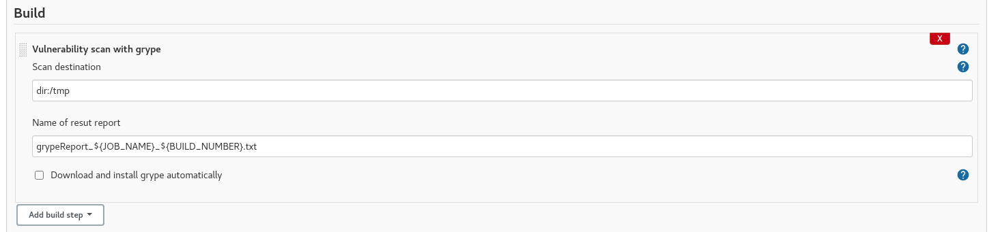
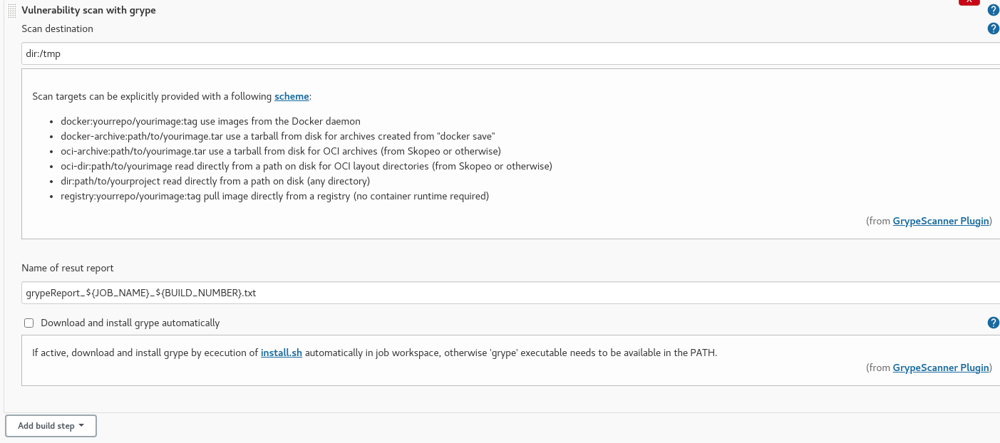
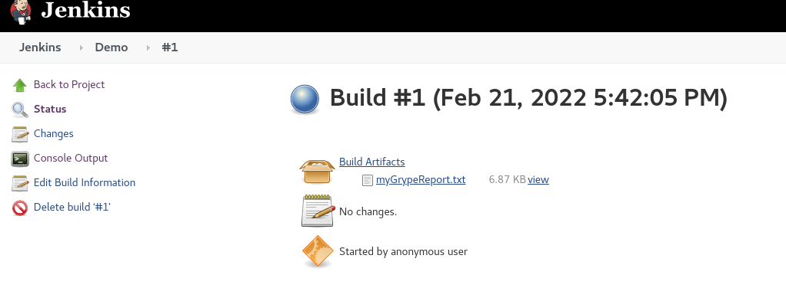
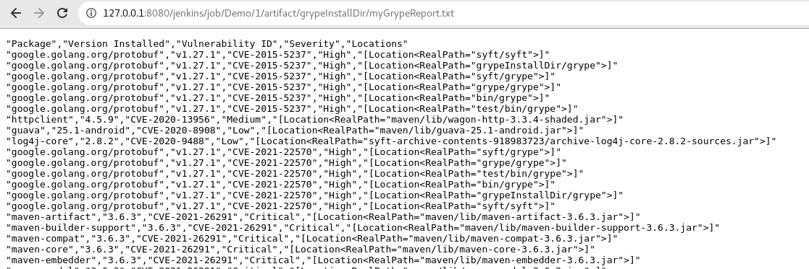

# Grype vulnerability scanner

## Introduction

[Grype](https://github.com/anchore/grype) is a vulnerability scanner for container images and filesystems.
This jenkins plugin scans a given target and saves a report as job artifact.

## Getting started
This jenkins plugin installs grype in the job workspace directory and performs scan. 
See section [https://github.com/anchore/grype](Installation/Recommended) for more details.
 

#### Grype as a build step:

#### Possible scan targets:

#### Scan result as job artifact:

#### Scan results:

     

###Usage in a pipeline:
pipeline  
{  
&nbsp;agent any  
&nbsp;&nbsp;options  
&nbsp;{  
&nbsp;&nbsp;skipStagesAfterUnstable()  
&nbsp;}  
&nbsp;stages  
&nbsp;{  
&nbsp;&nbsp;stage('Build')  
&nbsp;&nbsp;{  
&nbsp;&nbsp;&nbsp;steps  
&nbsp;&nbsp;&nbsp;{  
&nbsp;&nbsp;&nbsp;step([$class: 'GrypeScannerStep', scanDest: 'dir:/tmp', repName: 'myScanResult.txt'])  
&nbsp;&nbsp;&nbsp;}  
&nbsp;&nbsp;}  
&nbsp;}  
}  

## Issues

TODO Decide where you're going to host your issues, the default is Jenkins JIRA, but you can also enable GitHub issues,
If you use GitHub issues there's no need for this section; else add the following line:

Report issues and enhancements in the [Jenkins issue tracker](https://issues.jenkins-ci.org/).

## Contributing

TODO review the default [CONTRIBUTING](https://github.com/jenkinsci/.github/blob/master/CONTRIBUTING.md) file and make sure it is appropriate for your plugin, if not then add your own one adapted from the base file

Refer to our [contribution guidelines](https://github.com/jenkinsci/.github/blob/master/CONTRIBUTING.md)

## LICENSE

Licensed under MIT, see [LICENSE](LICENSE.md)

